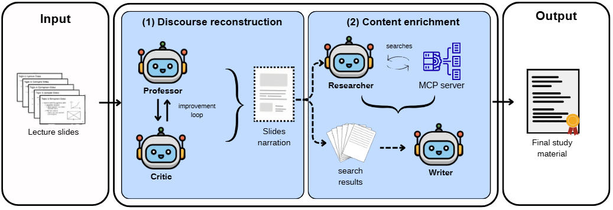

<div align="center">
  <h1>Automatic Generation of <br> Study Texts from Lecture Slides</h1>
  
  
  
</div>

<br/>
<div align="center">A pipeline that employs specialized components to convert lecture slide decks into grounded study texts.</div>
<br/>

<div align="center">
  </img>
</div>


## Getting Started

1. **Configure Environment:**
   ```bash
   cp .env.example .env
   # Edit .env and set your OPENROUTER_API_KEY
   ```

2. **Run the pipeline:**
   ```bash
   uv sync --group notebook
   uv run jupyter lab main.ipynb
   ```
   Models and run parameters are configured in the notebook. Outputs are written to `results/`.


## Project Structure
- `main.ipynb`: entry point.
- `pipeline/`: agents (`nodes.py`), orchestration (`graph.py`), writer (`compose.py`), prompts, LLM client, disk cache and PDF export.
- `runs.py`: experiment tracing.
- `data/`: lecture material used in the paper.